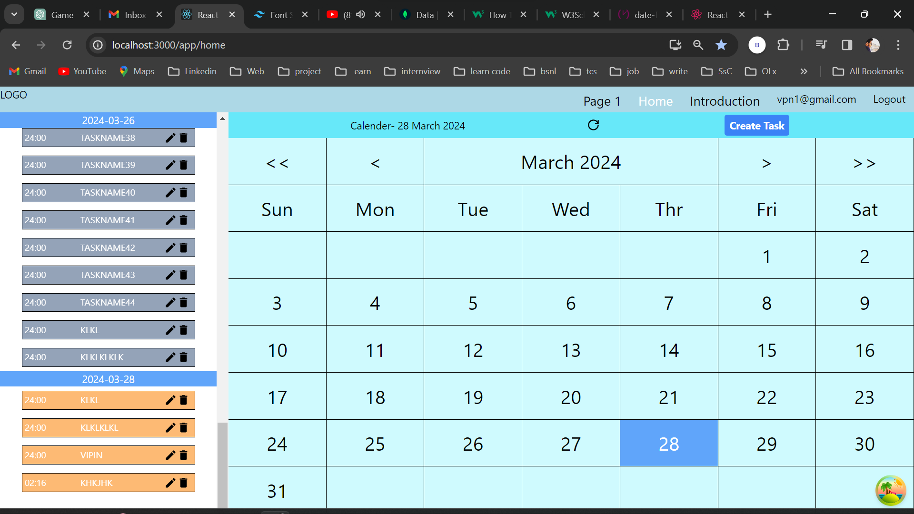
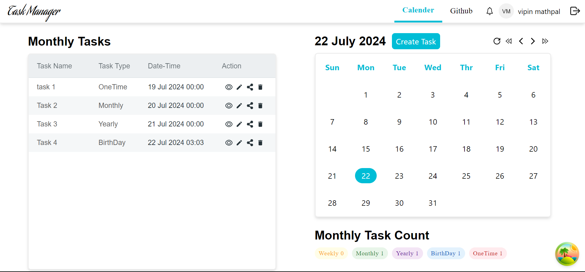

# Task Management Web App

Welcome to our Task Management Web Application! This application is built using React for the frontend and Node.js for the backend. It provides a comprehensive task management system with features like task creation, editing, deletion, recurrence, and sharing.

## Table of Contents

- [Features](#features)
- [Technologies Used](#technologies-used)
- [Installation](#installation)
- [Usage](#usage)
- [Contributing](#contributing)
- [License](#license)

## Features

- **Task Management**: Create, edit, and delete tasks.
- **Recurrence**: Set tasks to recur daily, monthly, yearly, or for special occasions like birthdays.
- **Task Sharing**: Share tasks with other users for better collaboration.
- **Authentication**: Secure JWT-based authentication using context hooks and HTTP-only cookies.

## Technologies Used

### Frontend

- **React**: A JavaScript library for building user interfaces.
- **React-Redux**: To manage and centralize the application state.

### Backend

- **Node.js**: A JavaScript runtime built on Chrome's V8 JavaScript engine.

### Authentication

- **JWT (JSON Web Token)**: For secure authentication using context hooks and storing tokens in HTTP-only cookies.

## Installation

To run this application locally, follow these steps:

1. Clone the repository:

   ```bash
   git clone https://github.com/your-username/task-management-app.git
   cd task-management-app

# TaskManager

#react 
https://create-react-app.dev/docs/getting-started

#npm  React template 
https://www.npmjs.com/search?q=cra-template-*

#Adding typescript in existing project
https://create-react-app.dev/docs/adding-typescript/


##Using React with javascript


##Backend 
``` 
mkdir backend
cd backend
npm init -y
npm install express mongoose bcrypt cors jsonwebtoken body-parser dotenv
```

###frontend 

```npx create-react-app my-app
cd my-app
npm start
```
## refer the youtube video for HTTPonly cookie setup
 https://www.youtube.com/watch?v=a5Krfkfl9MM&ab_channel=RahulAhire  


## send props and function between child and parent
https://stackoverflow.com/questions/37949981/call-child-method-from-parent

## Redux 
https://www.youtube.com/watch?v=1i04-A7kfFI&ab_channel=ChaiaurCode
Redux Toolkit is available as a package on NPM for use with a module bundler or in a Node application:

```
npm install @reduxjs/toolkit
```
If you need React bindings:
```
npm install react-redux
```
The package includes a precompiled ESM build that can be used as a <script type="module"> tag directly in the browser.

## icons 
https://react-icons.github.io/react-icons/

calender : https://www.youtube.com/watch?v=s9-K02CP8hw&ab_channel=DailyWebCoding

tailwind css
https://tailwindcss.com/docs/installation


## React Query 
https://tanstack.com/query/latest/docs/framework/react/guides/queries


UI initial ->

newUI initial ->


